# Crypto 2.0 — preserved GCP disk recovery plan

2026-10-03. **OWNER MANUAL COMMANDS ONLY. No recovery commands executed by Codex.**
Starting branch `phase7a-pre-lightning-hardening-20261003`, HEAD
`0a4245e889c535e8bc57f0b78e52c08976536a52`. Verified tracked source clean;
existing untracked Linux verification evidence and interrupted `.orig`/`.rej` plan
remnants preserved outside the commit. Only this plan is added.
Gold remains REAL_GOLD_VALIDATED=YES and is not touched by this procedure.

## 1. Blocker and immutable source

TRUSTED_FINAL_SILVER_NOT_FOUND and FULL_LINEAGE_CLOSURE=NO. GCS discovery proved the
canonical registry identity, but not final Phase7A daily Silver, universe,
acquisition/run/Fold1 checkpoint closure.
The two complete known-bucket inventories are documented in
[external-state recovery discovery](PHASE7A_LIGHTNING_EXTERNAL_STATE_RECOVERY_DISCOVERY.md).
Do not substitute older Windows Silver, derivative Silver, regenerated data or current
exchange history. No preparation/training/GPU work is authorized.

Historical project `crypto-ai-trading-506300`, VM `crypto-phase7`, zone
`asia-south1-a`, e2-standard-16, and an approximately 250 GB pd-balanced source disk.
The source-disk name is deliberately not assumed; derive it from snapshot metadata.
These are historical facts, not fresh infrastructure verification. Snapshot **candidate**
`crypto-phase7-safety-20260907`: existence, READY state, source disk identity, encryption
and capture time must be verified by the owner. Never start/connect/SSH to the original
VM, attach/mount/change the original disk, repair a filesystem, delete a snapshot or
run Crypto 2.0 from the recovery machine.

```mermaid
flowchart LR
 S[Existing verified safety snapshot] --> C[NEW clone disk]
 C -->|secondary attachment mode RO| V[Isolated VM with fresh OS boot disk]
 V -->|RO device and no journal replay| M[Read-only mount]
 M --> I[Metadata inventory and identity review]
 I -->|selected verified files only| G[NEW GCS recovery session prefix]
 G --> L[Lightning hash and lineage qualification]
```



This plan creates **no** snapshot. Original disk and existing snapshot remain unchanged.
Clone contents are never booted, executed, repaired or mounted read-write. Crash-consistent
snapshots can expose incomplete files when journal replay is suppressed; stop on missing,
unreadable or mismatched evidence. Do not silently recover a journal to make hashes pass.

## 2. Exact required-state targets traced from code

O=`/home/nssharath123/crypto2.0`; A=O/local_artifacts/phase7;
D=O/data/phase7; C=A/checkpoints;
R=`phase7a-core20-primary-93f987736b1a79d26b773957`;
S=`phase7-cc550337f1f4ee4654124bf6`.

Source owners: `pipeline._load_stage_state`, `_fold_descriptors`;
`run_phase7a_pipeline._registry_stage`, `_reuse_discovery`, `_run_stage_owned`;
`DiscoverySymbolCheckpointStore.checkpoint_path`; `SilverPromoter.promote`;
`acquisition.load_candle_family`, `validated_candle_manifest_range`,
`_silver_segment_manifests`; `CheckpointStore`; training descriptor/cache identities.
The registry embeds lifecycle; there is no separate lifecycle file required by this loader.

| RECOVERY_TARGET | EXPECTED_OLD_PATH_OR_PATTERN | EXPECTED_VERSION / identity | EXPECTED_HASH_IF_KNOWN | REQUIRED_FOR_FOLD1 | REQUIRED_FOR_LINEAGE | ESTIMATED_SIZE |
| --- | --- | --- | --- | --- | --- | --- |
| Final registry + lifecycle | A/R/registry/symbol_registry.json; canonical A/S/registry/symbol_registry.json | symbol_registry_v1; registry b2c973f0050f205e58672558 | canonical file SHA 200d9d63be9d8cae9799cb81f2bb886620a8ddb033c3ab7d4687fc2c310bcbd4 | YES | YES | canonical 2,193,617 B; final verify |
| Registry provenance | A/S/registry/catalog_summary.json, source_verification.json; A/R/registry/reuse_lineage.json | original immutable lineage | canonical catalog d2765956f8e1948120ae4842f0d021c3f1f170b9ab39d6c45776c55703a4eb84; verification 984ca1ac3bb7b2ca76b81a2a74e11b53c3bb73a92560c1dbba7acb6d81c91bb0 | stage trust | YES | canonical pair 1,125 B |
| Core PIT universe | A/R/universe/core_universe.json | core_universe_v1; f71cdf65d161466037b34420 | full file SHA from checkpoint | YES | YES | unknown until inventory |
| Universe policy/history | A/R/universe/expansion_policy.json, fold_memberships.json, selection_descriptors.json, discovery_data.json | policy8b07069e46bf6257961ea79d; research universe94a9ce4759dd8d3303841f13 | checkpoint SHA; numerical descriptor identity | policy YES; history supporting evidence | YES | unknown |
| Final data manifest | A/R/data/data_manifest.json | config93f987736b1a79d26b773957 | e6532a8b6fe7246621530738b713c6529b538d219802ba77f3f3a4dad6959dd0 | YES | YES | unknown |
| Daily Silver manifests | exact data.candle_silver_manifests[1d] values | silver-{24hex}; v2 versioned transformation | project references, per-child SHA | YES | YES | exact versions unknown before data manifest |
| Final daily Silver partitions | D/silver/binance/ + each child output_files[].file | candle schema1.0.0, validator1.2.0; sort-and-exact-deduplicate-v2-versioned-paths | each output_files[].sha256 | YES | YES | calculate exact referenced set; no estimate fabricated |
| Segment group/children | manifest_kind=phase7_causal_segment_group; segments[].silver_manifest | causal_segment_quarantine_v1 | silver_manifest_sha256 and source_manifest_sha256 | YES when referenced | YES | unknown |
| Source manifests | Silver source_manifest, segment source_manifest; D/bronze/binance/manifests/{run_id}.json | original source dataset/run/schema and UTC range | checkpoint/evidence SHA where recorded | metadata YES | YES | unknown |
| Final quality report/checkpoint evidence | D/quality/{validation_report_id}.json; quality references embedded in discovery/acquisition and stage checkpoints; no standalone quality-stage checkpoint is defined by traced code | report_schema1.0.0, validator1.2.0 and bound policy | quality_report_sha256 or checkpoint SHA | trust YES | YES | some reports >16 MiB; inventory before export |
| Discovery checkpoints | C/S/discovery/phase7_discovery_acquisition_v1/1.8.0/{SYMBOL}/{INTERVAL}.completed.json | discovery schema_v1; S/config/registry/request | internal checkpoint_hash plus evidence SHA | historical reuse trust | YES | sample3,549 B; enumerate unique 507 candidates |
| Strict acquisition checkpoints | C/R/discovery/phase7_full_range_acquisition_v1/1.8.0/{SYMBOL}/{INTERVAL}.completed.json | strict full coverage true; R/config/request | internal hash and evidence SHA | stage trust YES | YES | 60 candle sets historical; sizes unknown |
| Phase7A stage checkpoints | C/R/{registry,universe,data,gold}.json; C/S/registry.json | exact run/stage/config/file inventory | data.json SHA d7bb7e99dda07ec62cd493a3c06951d6dae230f340c065b9bd42bd2423a99c0f; Gold checkpoint SHA unknown | YES | YES | unknown |
| Run and Gold result | A/R/run.json, gold/result.json | R; Gold gold-phase7-0cbf2910e8d96c9d19826598 | checkpoint SHA; existing Gold manifest a142027722424ead5bbc508537e85bf743b3da68b38c3a99c9aabd3ef0e2e711 | YES | YES | unknown; do not recopy Gold |
| Fold1 state | A/R/canary_started.json; optional existing canary_summary.json; C/R/train/CORE/fold-000-a0e9a4f72689/*.json if any | STARTED_NOT_COMPLETE, 0/48, models0, folds0/16 | original file SHA if present | resume evidence | YES | completion records expected absent; never fabricate |
| Descriptor/context state | A/R/fold_descriptors.json if persisted; selection/fold membership artifacts | causal_descriptor_identity, source_max_time < train_end | numerical/manifest identity from original records | daily source remains required | YES | may be absent/interrupted; never reconstruct in this phase |
| Additional closure | every files/evidence_files/source/quality/segment/partition reference in selected stage checkpoints and manifests | original recorded versions | original reference SHA | when demanded by reuse validation | YES | enumerate before choosing restore scope |

Do not use a broad `data/**` restore. The final metadata determines exact filenames and
any extra 5m/12h/derivative evidence required by completed-stage inventories. Those are
not inferred solely from the daily preparation need. Bronze Parquet is not automatically
selected; recover only if the original checkpoint's verified evidence closure requires it.
Fold1 descriptor window [2021-10-03,2022-01-01), train end2022-01-01 exclusive.
Current `_fold_descriptors` computes all planned folds: other causal lookbacks may be
needed by the unchanged runner. Do not truncate science for convenience.

## 3. OWNER MANUAL COMMANDS

Run these in **Google Cloud Shell with the owner's existing account**, not in Codex.
They are a plan, not execution authorization for paid resources. Before section 3.2,
owner approves temporary-resource cost ceiling/deadline and the selected existing network.
No new IAM grants, service-account keys or firewall/network changes are part of this plan.
Stop on failed commands, resource-name collisions, unavailable permissions, missing
snapshot, wrong source identity, unexpected inherited startup automation or encryption
requiring unavailable owner-managed access. Never work around these by using production.

### 3.1 Owner metadata verification only

```bash
set -euo pipefail
export REC_PROJECT=crypto-ai-trading-506300
export REC_ZONE=asia-south1-a
export REC_SNAPSHOT=crypto-phase7-safety-20260907
export REC_SESSION="$(date -u +%Y%m%dT%H%M%SZ)"
export REC_VM="crypto2-recovery-${REC_SESSION,,}"
export REC_DISK="crypto2-recovery-data-${REC_SESSION,,}"
export REC_BUCKET=gs://crypto2-phase7-migration-258783580370
export REC_PREFIX="$REC_BUCKET/historical-state-recovery/$REC_SESSION"
export REC_EVIDENCE="$HOME/crypto2-recovery-evidence-$REC_SESSION"
mkdir -m 700 "$REC_EVIDENCE"
gcloud config set project "$REC_PROJECT"
# Expected: project property updated; no cloud resource change.
test "$(gcloud config get-value project)" = "$REC_PROJECT"
gcloud compute snapshots describe "$REC_SNAPSHOT" --project="$REC_PROJECT" \
  --format=json > "$REC_EVIDENCE/snapshot-before.json"
# Expected: READY; correct sourceDisk/sourceDiskId; creation after final Sept6 state.
test "$(gcloud compute snapshots describe "$REC_SNAPSHOT" --project="$REC_PROJECT" \
  --format='value(status)')" = READY
export REC_SOURCE_DISK_URI="$(gcloud compute snapshots describe "$REC_SNAPSHOT" \
  --project="$REC_PROJECT" --format='value(sourceDisk)')"
export REC_SOURCE_DISK="${REC_SOURCE_DISK_URI##*/}"
export REC_SOURCE_ZONE="${REC_SOURCE_DISK_URI#*/zones/}"
export REC_SOURCE_ZONE="${REC_SOURCE_ZONE%%/*}"
test -n "$REC_SOURCE_DISK"
test "$REC_SOURCE_ZONE" = "$REC_ZONE"
gcloud compute disks describe "$REC_SOURCE_DISK" --project="$REC_PROJECT" \
  --zone="$REC_SOURCE_ZONE" --format=json \
  > "$REC_EVIDENCE/source-disk-metadata.json"
# Expected: source disk ID matches snapshot sourceDiskId; approximately250GB.
test "$(gcloud compute disks describe "$REC_SOURCE_DISK" --project="$REC_PROJECT" \
  --zone="$REC_SOURCE_ZONE" --format='value(id)')" = \
  "$(gcloud compute snapshots describe "$REC_SNAPSHOT" --project="$REC_PROJECT" \
  --format='value(sourceDiskId)')"
gcloud compute project-info describe --project="$REC_PROJECT" \
  --format='json(commonInstanceMetadata)' > "$REC_EVIDENCE/project-metadata.json"
gcloud compute project-zonal-metadata describe --project="$REC_PROJECT" \
  --zone="$REC_ZONE" --format=json > "$REC_EVIDENCE/zonal-metadata.json"
# Owner checks both files privately for inherited startup automation; do not upload them.
```

Inspect snapshot status/source IDs/capture timestamp/diskSizeGb/storage locations and
any KMS encryption metadata. Snapshot existence is **not** proven by this document.
Review owner-network isolation and existing IAP/SSH access. A Sept7 snapshot must actually
contain the hash-bound final Sept6 files; timestamp/name alone cannot prove that.
If snapshot absent or wrong: STOP. Do not create a new snapshot or access original disk.
The original VM does not need to be described, started or otherwise accessed. The private
project/zonal metadata files may contain sensitive values; never include them in exports.

### 3.2 Fresh clone and isolated fresh-OS VM — owner only after gates

The subnet URI is genuinely unknown. Replace the placeholder with an owner-reviewed
**existing isolated subnet**, with existing private/IAP SSH access. Review project/network
policies first and require no Internet/Cloud NAT egress from the recovery VM; if no such
subnet with working IAP exists, STOP rather than creating or weakening a network.
No public address, no service account, no GPU, no copied startup scripts.
Use a fresh public OS image, never the recovered disk as boot disk.

```bash
export REC_SUBNET='OWNER_REVIEWED_EXISTING_SUBNET_URI'
test "$REC_SUBNET" != OWNER_REVIEWED_EXISTING_SUBNET_URI
# Expected: success only after replacing with reviewed existing subnet URI.
gcloud compute disks create "$REC_DISK" --project="$REC_PROJECT" \
  --zone="$REC_ZONE" --type=pd-balanced --source-snapshot="$REC_SNAPSHOT"
# Expected: NEW disk READY, snapshot size inherited; original disk unchanged.
gcloud compute disks describe "$REC_DISK" --project="$REC_PROJECT" \
  --zone="$REC_ZONE" --format=json > "$REC_EVIDENCE/clone-disk.json"
# Expected: sourceSnapshot/sourceSnapshotId match reviewed snapshot.
gcloud compute instances create "$REC_VM" --project="$REC_PROJECT" \
  --zone="$REC_ZONE" --machine-type=e2-small \
  --image-family=debian-12 --image-project=debian-cloud \
  --boot-disk-size=20GB --boot-disk-type=pd-balanced \
  --subnet="$REC_SUBNET" --no-address --no-service-account --no-scopes \
  --metadata=startup-script=,startup-script-url=,enable-osconfig=FALSE
# Expected: NEW temporary CPU VM with independent clean boot disk, no source clone boot.
gcloud compute instances attach-disk "$REC_VM" --project="$REC_PROJECT" \
  --zone="$REC_ZONE" --disk="$REC_DISK" --device-name=crypto2-recovery-data \
  --mode=ro --interface=SCSI
# Expected: secondary attachment boot=false, mode=READ_ONLY.
gcloud compute instances describe "$REC_VM" --project="$REC_PROJECT" \
  --zone="$REC_ZONE" --format='json(name,disks,networkInterfaces,serviceAccounts)' \
  > "$REC_EVIDENCE/recovery-vm.json"
# Verify clone attached READ_ONLY and boot=false before proceeding.
gcloud compute ssh "$REC_VM" --project="$REC_PROJECT" --zone="$REC_ZONE" \
  --tunnel-through-iap
# Expected: shell on crypto2-recovery-* ONLY. If IAP unavailable STOP; no IAM workaround.
```

[GCP disk-from-snapshot command](https://docs.cloud.google.com/sdk/gcloud/reference/compute/disks/create)
creates the clone. [Read-only attachment](https://docs.cloud.google.com/sdk/gcloud/reference/compute/instances/attach-disk)
uses mode=ro; never add --boot or --force-attach. VM controls follow the
[instance creation reference](https://docs.cloud.google.com/sdk/gcloud/reference/compute/instances/create).

### 3.3 Guest: identify device/filesystem before mounting

These commands execute only on the new recovery VM. Writes go to its clean boot disk.
Do not `chroot`, run a copied binary/script, source an old profile or import old code.
No fsck, mkfs, resize, journal replay or writable mount is permitted.

```bash
set -euo pipefail
command -v python3 sha256sum lsblk blkid findmnt blockdev
# Expected: required basic tools present; otherwise STOP for owner tool review.
export REC_BLOCK=/dev/disk/by-id/google-crypto2-recovery-data
test -b "$REC_BLOCK"
sudo blockdev --getro "$REC_BLOCK"
# Expected: 1. If 0 STOP; inspect cloud attachment, do not modify the device.
lsblk -o NAME,PATH,SIZE,TYPE,FSTYPE,UUID,RO,MOUNTPOINTS "$REC_BLOCK"
sudo blkid -p "$REC_BLOCK"
# A partitioned disk may show PTTYPE=gpt rather than a filesystem; that is not an error.
# Owner identifies the root filesystem partition using lsblk/by-id, NOT /dev/sda guessing.
export REC_FS='OWNER_VERIFIED_FILESYSTEM_DEVICE_PATH'
test "$REC_FS" != OWNER_VERIFIED_FILESYSTEM_DEVICE_PATH
test -b "$REC_FS"
sudo blkid -p "$REC_FS"
sudo blockdev --getro "$REC_FS"
# Expected: recognized filesystem type and RO=1, no existing mount.
sudo mkdir -p /mnt/crypto2-recovery-ro
```

For a typical partitioned SCSI clone, a candidate is
`/dev/disk/by-id/google-crypto2-recovery-data-part1`; confirm from actual output first.
LUKS/LVM/RAID, unknown filesystem, auto-mounted volume or ambiguous root partition:
STOP and obtain a separate read-only device-layout plan. Do not activate/repair blindly.

Run **only the matching filesystem branch**:

```bash
# If blkid proves TYPE=ext4 (or ext3):
sudo mount -t ext4 -o ro,noload,nodev,nosuid,noexec "$REC_FS" /mnt/crypto2-recovery-ro
# Expected: read-only mount; journal NOT loaded/replayed. For ext3 use -t ext3.
# If blkid proves TYPE=xfs, use this instead, NEVER the preceding branch:
# sudo mount -t xfs -o ro,norecovery,nouuid,nodev,nosuid,noexec "$REC_FS" /mnt/crypto2-recovery-ro
# Expected: read-only XFS mount without recovery; nouuid accommodates cloned UUID.
findmnt -no SOURCE,FSTYPE,OPTIONS --target /mnt/crypto2-recovery-ro
# Expected: chosen clone partition, correct FS, ro and specified recovery suppression.
```

[ext4 manual](https://man7.org/linux/man-pages/man5/ext4.5.html): ordinary ro alone can
still replay the journal; noload suppresses loading it. Files may be inconsistent after
an unclean shutdown. [XFS manual](https://man7.org/linux/man-pages/man5/xfs.5.html):
norecovery requires a read-only mount; nouuid avoids duplicate UUID checks. Unreadable or
hash-mismatched files remain blocked; do not repair even the clone in this procedure.
Other filesystem types require owner review of their own no-recovery read-only options.

### 3.4 Guest: target-root discovery and metadata-only staging

```bash
export REC_MOUNT=/mnt/crypto2-recovery-ro
sudo find "$REC_MOUNT/home" "$REC_MOUNT/data" "$REC_MOUNT/mnt" \
  -xdev -maxdepth 5 -type d -name crypto2.0 -print 2>/dev/null || true
# Expected: old repository root, commonly /mnt/crypto2-recovery-ro/home/nssharath123/crypto2.0.
# Missing /data or /mnt is acceptable; missing repo root is a STOP, not a guess.
export REC_REPO="$REC_MOUNT/home/nssharath123/crypto2.0"
test -d "$REC_REPO"
export REC_STAGE="$HOME/crypto2-recovery-stage"
mkdir -m 700 "$REC_STAGE"
mkdir -m 700 "$REC_STAGE/evidence"
mkdir -m 700 "$REC_STAGE"/{registry,universe,silver,checkpoints,manifests}
sudo find "$REC_REPO" -xdev -maxdepth 8 -type d \( \
  -iname data -o -iname silver -o -iname registry -o -iname universe \
  -o -iname phase7 -o -iname 'phase7a*' -o -iname checkpoints \
  -o -iname discovery -o -iname acquisition -o -iname quality \
  -o -iname manifests -o -iname segments -o -iname 'descriptor*' \
  -o -iname '*core20*' \) -printf '%p\n' \
  | sort > "$REC_STAGE/evidence/candidate-directories.txt"
sudo find "$REC_REPO/local_artifacts/phase7" "$REC_REPO/data/phase7" \
  -xdev -type f \( -iname '*manifest*' -o -iname '*checkpoint*' \
  -o -iname '*descriptor*' -o -iname '*universe*' -o -iname '*completed.json' \
  -o -iname '*registry*' -o -iname '*canary*' \) -printf '%p\t%s\t%T@\n' \
  | sort > "$REC_STAGE/evidence/candidate-paths.tsv"
sudo find "$REC_REPO/local_artifacts/phase7" "$REC_REPO/data/phase7" \
  -xdev -type f -size -16M \( -iname '*.json' -o -iname '*.yaml' \
  -o -iname '*.yml' -o -iname '*.txt' -o -iname '*.csv' \) \
  -printf '%p\t%s\t%T@\n' \
  | sort > "$REC_STAGE/evidence/small-metadata-candidates.tsv"
# Expected: directories and filenames/sizes/mtimes only; no values or OS-wide hashing.
```

Search other repo roots only if the known root is absent, using directory names as hints.
Do not export `.ssh`, `.aws`, `.config`, gcloud configs, environment files, tokens,
private keys, logs or arbitrary TXT/CSV. The allowed extensions are not proof of no secrets.
Use the exact known run/checkpoint metadata and referenced market-data manifests only.

Run this **stdlib-only metadata inventory/staging script written by the owner** on the
fresh OS, never a script from the recovered repo. It refuses symlinks/path escape and
large files, and preserves original repo-relative paths beneath each logical role. It does not select Parquet.

```bash
sudo env REC_REPO="$REC_REPO" REC_STAGE="$REC_STAGE" python3 - <<'PY'
import base64, csv, hashlib, json, os, stat
from pathlib import Path
root = Path(os.environ['REC_REPO']).resolve()
stage = Path(os.environ['REC_STAGE']).resolve()
run = 'phase7a-core20-primary-93f987736b1a79d26b773957'
source = 'phase7-cc550337f1f4ee4654124bf6'
a = root/'local_artifacts/phase7'
selected = set()
# Metadata only: exact run metadata and checkpoint trees, excluding logs/secrets/models.
for base in (a/run, a/'checkpoints'/run, a/'checkpoints'/source):
    if base.is_dir():
        selected.update(p for p in base.rglob('*.json'))
for base in (a/source/'registry',):
    if base.is_dir():
        selected.update(p for p in base.glob('*.json'))
expected = {
    a/run/'data/data_manifest.json': 'e6532a8b6fe7246621530738b713c6529b538d219802ba77f3f3a4dad6959dd0',
    a/'checkpoints'/run/'data.json': 'd7bb7e99dda07ec62cd493a3c06951d6dae230f340c065b9bd42bd2423a99c0f',
}
for name in ('recovery_inventory.csv', 'recovery_manifest.json'):
    if (stage/'evidence'/name).exists():
        raise SystemExit('REFUSE_EXISTING_EVIDENCE: use fresh staging directory')
rows = []
for p in sorted(selected):
    if any(q.is_symlink() for q in (p, *p.parents)) or not p.resolve().is_relative_to(root):
        raise SystemExit(f'REJECT_SYMLINK_OR_ESCAPE: {p}')
    st = p.stat()
    if not stat.S_ISREG(st.st_mode):
        raise SystemExit(f'REJECT_TYPE: {p}')
    if st.st_size > 16*1024*1024:
        raise SystemExit(f'METADATA_SIZE_REVIEW_REQUIRED: {p} {st.st_size}')
    content = p.read_bytes()
    json.loads(content)  # malformed/incomplete metadata fails closed
    digest = hashlib.sha256(content).hexdigest()
    if p in expected and digest != expected[p]:
        raise SystemExit(f'EXPECTED_HASH_MISMATCH: {p}')
    rel = p.relative_to(root).as_posix()
    parts = p.relative_to(root).parts
    role = ('checkpoints' if 'checkpoints' in parts else
            'registry' if 'registry' in parts else
            'universe' if 'universe' in parts else 'manifests')
    dst = stage/role/rel
    dst.parent.mkdir(parents=True, exist_ok=True)
    if dst.exists():
        raise SystemExit(f'REFUSE_OVERWRITE: {dst}')
    dst.write_bytes(content)
    rows.append(dict(original_cloned_disk_path=str(p), old_path='/home/nssharath123/crypto2.0/'+rel,
                     relative_path=rel, type='regular', bytes=st.st_size, mtime_ns=st.st_mtime_ns,
                     sha256=digest, logical_role=role,
                     gcs_relative_destination=role+'/'+rel,
                     transport_md5_base64=base64.b64encode(hashlib.md5(content).digest()).decode(),
                     provider_md5=None, provider_crc32c=None, provider_generation=None,
                     scientific_hash=expected.get(p), status='METADATA_ONLY_UNREVIEWED'))
missing = [str(p) for p in expected if not p.is_file()]
(stage/'evidence/recovery_manifest.json').write_text(json.dumps(
    dict(schema='crypto2_readonly_recovery_inventory_v1', files=rows,
         missing_required_anchors=missing, complete=False), indent=2)+'\n')
with (stage/'evidence/recovery_inventory.csv').open('w', newline='') as out:
    keys=list(rows[0]) if rows else ['relative_path']
    writer=csv.DictWriter(out, fieldnames=keys); writer.writeheader(); writer.writerows(rows)
print('METADATA_FILES',len(rows),'BYTES',sum(r['bytes'] for r in rows),'MISSING_ANCHORS',missing)
if missing:
    raise SystemExit('REQUIRED_ANCHOR_MISSING: STOP before accepting a restore set')
PY
# Expected: matching final manifest/checkpoint hashes, metadata count/bytes, no missing anchors.
sudo chown -R "$(id -u):$(id -g)" "$REC_STAGE"
# This changes staging on the fresh boot disk ONLY, never the cloned filesystem.
```

The inventory is intentionally provisional (`complete=false`). Do not mistake it for
full lineage proof. A partial staging directory after failure is not upload-ready; preserve
it, inspect the failure, and use a fresh staging name for a later approved retry.
Inspect selected JSON privately for secrets before export. Assign each file its exact
logical role (registry/universe/checkpoint/etc.) from the required-state table; provisional
directory-based roles do not constitute final scientific classification. Record original
scientific identity separately from the file SHA when available; unknown values stay null.

### 3.5 Metadata identity review, then referenced metadata only

Before expanding selection, compare both full anchor hashes, R/S/config identities,
registry identity, Core20/policy hashes and Gold result dataset ID. Validate checkpoint
internal hashes from independently reviewed current software on Lightning or Cloud Shell,
not by executing the recovered repo. Stage file inventories must match their recorded SHA.
Discovery schema/current-version directories must not be conflated with old duplicates.

Follow final data.candle_silver_manifests[1d] values. For each group, follow source_manifest,
segments[].silver_manifest and recorded SHA, child validation_report_id/quality_report
references, output_files[].file and SHA. Also follow files/evidence_files in completed
stage checkpoints. Resolve absolute O/... through REC_MOUNT, never through the recovery
VM's live /home. Require every resolved path beneath the verified recovered repo, ordinary
file/no symlink, and exact logical role. Referenced external paths outside O are STOP/review.

Append those **metadata-only** files to a separate reviewed list using actual references;
never guess final Silver IDs from the sample BTC discovery version. Use the same
size/JSON/hash/no-overwrite checks above and record original path/mtime/role. Place
reviewed Silver manifest metadata under `silver/<original repo-relative path>` and source/segment/
quality manifests under `manifests/<original repo-relative path>`; preserve reference bytes. Files >16MiB
require a specific metadata-size review, not an automatic broad copy. Do not copy Parquet
until the final chain is independently approved. Required TXT/YAML/CSV may be selected only
when explicitly referenced and reviewed, with hashing but without JSON parsing.

The exact reference-expanded list cannot be prefilled: final manifest bytes have not yet
been found. This is a deliberate stop gate, not authorization to invent a substitute list.

### 3.6 Owner Cloud Shell: transfer reviewed metadata to a new GCS session

Exit the recovery VM shell. REC_* variables from section3.1 remain in Cloud Shell.
Use the owner's existing Cloud Shell authentication, not a service-account key or credentials
installed on the recovery VM. No credential-bearing directories are transferred.

```bash
mkdir -m 700 "$REC_EVIDENCE/guest"
gcloud compute scp --recurse "$REC_VM:~/crypto2-recovery-stage" \
  "$REC_EVIDENCE/guest/" --project="$REC_PROJECT" --zone="$REC_ZONE" \
  --tunnel-through-iap
# Expected: reviewed metadata staging only; no Parquet or original OS files.
gcloud storage ls "$REC_PREFIX/**"
# Expected: no objects; a nonzero 'no matches' must be distinguished from auth/network failure.
# If ANY object already exists, choose a NEW session; never resume an ambiguous prefix.
for REC_ROLE in registry universe silver checkpoints manifests; do
  REC_LOCAL_ROLE="$REC_EVIDENCE/guest/crypto2-recovery-stage/$REC_ROLE"
  test -d "$REC_LOCAL_ROLE"
  if ! find "$REC_LOCAL_ROLE" -type f -print -quit | read -r REC_FIRST_FILE; then
    continue  # Empty role: GCS needs no directory placeholder.
  fi
  gcloud storage cp --recursive --if-generation-match=0 \
    "$REC_LOCAL_ROLE" "$REC_PREFIX/"
done
gcloud storage cp --recursive --if-generation-match=0 \
  "$REC_EVIDENCE/guest/crypto2-recovery-stage/evidence" "$REC_PREFIX/"
# Expected: new role directories and evidence/ objects only; refuses overwrite.
# Empty roles are skipped; any upload failure stops the procedure.
gcloud storage ls --json "$REC_PREFIX/**" > "$REC_EVIDENCE/provider-inventory.json"
# Expected: count/bytes/MD5/CRC32C/generation for every uploaded file.
```

The `ls` no-match test is interactive inspection: with set -e, run that check separately
or catch the status explicitly and review it; do not treat every error as an empty prefix.
[Storage cp reference](https://docs.cloud.google.com/sdk/gcloud/reference/storage/cp)
provides the generation-match precondition. Any precondition failure stops the export.
No destructive sync flags, no source deletion, no overwrite.

Layout: `historical-state-recovery/<unique UTC session>/` contains `evidence/`,
`registry/`, `universe/`, `silver/`, `checkpoints/`, and `manifests/`. Each recovered file
uses `<logical role>/<original repo-relative path>`; select each file once. Empty roles
need no GCS placeholder object. Keeping original relative paths prevents scientific
metadata rewrites. Gold prefix remains entirely separate.

After transfer, compare each inventory `transport_md5_base64` against the provider
MD5 from `provider-inventory.json` for its exact GCS destination. Require one object
per selected file, matching size and MD5; missing or different values STOP acceptance.
Record the full GCS URI as `REC_PREFIX + "/" + gcs_relative_destination` and
record CRC32C/generation (CRC32C not claimed independently verified unless computed).
Update a **new versioned evidence file**, e.g. recovery_manifest-v2.json, with GCS URI,
provider checksums/generation and scientific SHA status. Upload with generation-match0.
Do not overwrite recovery_manifest.json or change original metadata bytes. Only independently
hash-verified complete evidence can set `complete=true`.

## 4. Silver, checkpoint and universe acceptance gates

Silver: prove the final data-manifest SHA first. Its exact 1d manifest mapping chooses
versions; source identity/request range, original producer/schema/quality versions, child
segment hashes, symbols/time coverage/counts and every output SHA must agree. Require
sort-and-exact-deduplicate-v2-versioned-paths, validator1.2.0 and canonical candle schema.
Old Windows v1 Silver, derivatives, incomplete outputs, different versions and regenerated
replacements are rejected. No schema inference from filenames alone.

Checkpoint: verify original run/config/stage hashes and full file inventory, scientific
baseline/source identity where present, Gold/registry/universe/fold references and completion
state. Old missing identity requires explicit review; do not fabricate/upgrade fields to
current software. Phase7A must remain CORE20_PRIMARY. Fold1 remains STARTED_NOT_COMPLETE, reports0/48, models0, folds0/16;
Fold2 not started. Unexpected models/reports are quarantined for owner review, not executed
or loaded as pickle/joblib. Do not create a completed Fold1 checkpoint.

Universe: exact Core20, HNT retained, XPIN excluded; registry listing/history/lifecycle
records and 90d descriptors causally known by Fold1 train-end2022-01-01 exclusive.
source_max_time must precede as_of. Membership/policy/context hashes match original records.
Current registry/exchange/liquidity/future descriptors cannot reconstruct missing history.
July2026 unused; August LOCKED_UNUSED, used=false, evaluation_authorized=false.
Policy/absence checks only; no holdout model evaluation.

## 5. Later large-file transfer gate — not part of initial execution

After owner/Lightning metadata review establishes final identity, produce an exact ordered
`selected-partitions.csv` from accepted output_files references, with absolute clone path,
repo-relative destination, symbol/interval/version/range/size/mtime and expected SHA.
Hash only selected historical files; sum unique file count, Parquet count and bytes.
Check selected clone files exist, no symlinks, no forbidden ranges; recheck block/mount RO.
Do not hash the entire OS or copy all D/silver by directory name.

Owner checks staging/transit capacity and GCS bucket policy/quota/access for the new prefix
(GCS has no filesystem-style free-byte figure), Lightning `df -B1` available bytes and
sufficient reviewed reserve. A fresh approved transfer method must preserve relative paths
and verify project SHA plus transport MD5/generation. No large upload command is executed
or automatically authorized by this plan. Use exact-list generation-match0 uploads under
this recovery session or a fresh reviewed session; never validated Gold.

Recover only the required closure, not all 250GB. Extra daily partitions needed by complete
checkpoint inventories must be considered even when descriptor reads need smaller lookbacks.
If mandatory data are missing from snapshot: STOP, report exact failed identity/path and
review another immutable backup; no repairs or reconstruction.

## 6. Lightning follow-up and evidence completion

Only a separately authorized recovery/qualification phase may copy the selected GCS state to
`crypto2-persistent/data/phase7` and `crypto2-persistent/phase7/{artifacts,checkpoints}`.
Keep validated Gold in place. Before accepting legacy mappings, compare logical role,
relative path, dataset/version, SHA and original checkpoint/file inventory. Reuse the project's
explicit PHASE7_LEGACY_* mapping; do not edit old absolute references or canonical TOML.
Requalify registry, universe, source/segment manifests, strict acquisition/data/Gold checkpoints,
causal descriptor inputs and read-only resume plan. No matrices, fit or GPU. Full lineage
closure and external-state qualification must pass before any new preparation-profile scope.

Recovery evidence must include snapshot ID/source ID/capture metadata, clone ID/RO attachment,
filesystem/mount output, inventory timestamps, counts/bytes, per-file original clone path/type/
mtime/SHA/role/GCS URI/provider MD5/CRC32C/generation, expected scientific hashes, missing/
rejected references and original Fold1/holdout status. Do not upload private project metadata
or credentials. Preserve initial inventories; append versioned verification results.

## 7. Cleanup policy — deferred, separately owner-authorized

No cleanup occurs during initial recovery. Retain clone/VM/evidence until GCS transport/project
hashes, Lightning copy, full lineage closure and owner review PASS. Owner approves cleanup
explicitly afterward with recorded exact temporary VM/clone/boot-disk IDs. Unmount/detach/delete
only those temporary resources; original VM, original disk and safety snapshot are excluded.
No snapshot-delete command is provided. Do not delete by wildcard or inferred name. This plan
provides no initial cleanup execution block and does not authorize compute to run indefinitely;
owner-approved cost/deadline includes a reviewed temporary-VM stop decision preserving evidence.

## 8. Plan readiness

READY_TO_EXECUTE_OWNER_RECOVERY=YES **as a reviewed procedural plan**, conditional on owner
snapshot/source verification, existing network/IAP permissions and fresh temporary cost/deadline
approval. Snapshot existence remains OWNER MUST VERIFY. If those gates fail, no mutation step
is ready. No resource was inspected through GCP by Codex or created/started/attached/mounted.
Original VM/disk/snapshot and Lightning Gold remain untouched. Scientific methodology unchanged.

NEXT OWNER ACTION: in owner Google Cloud Shell, run
`gcloud config set project crypto-ai-trading-506300`. Then follow section 3.1 in order;
no clone/VM operation before all identity, isolation and cost/deadline gates pass.
