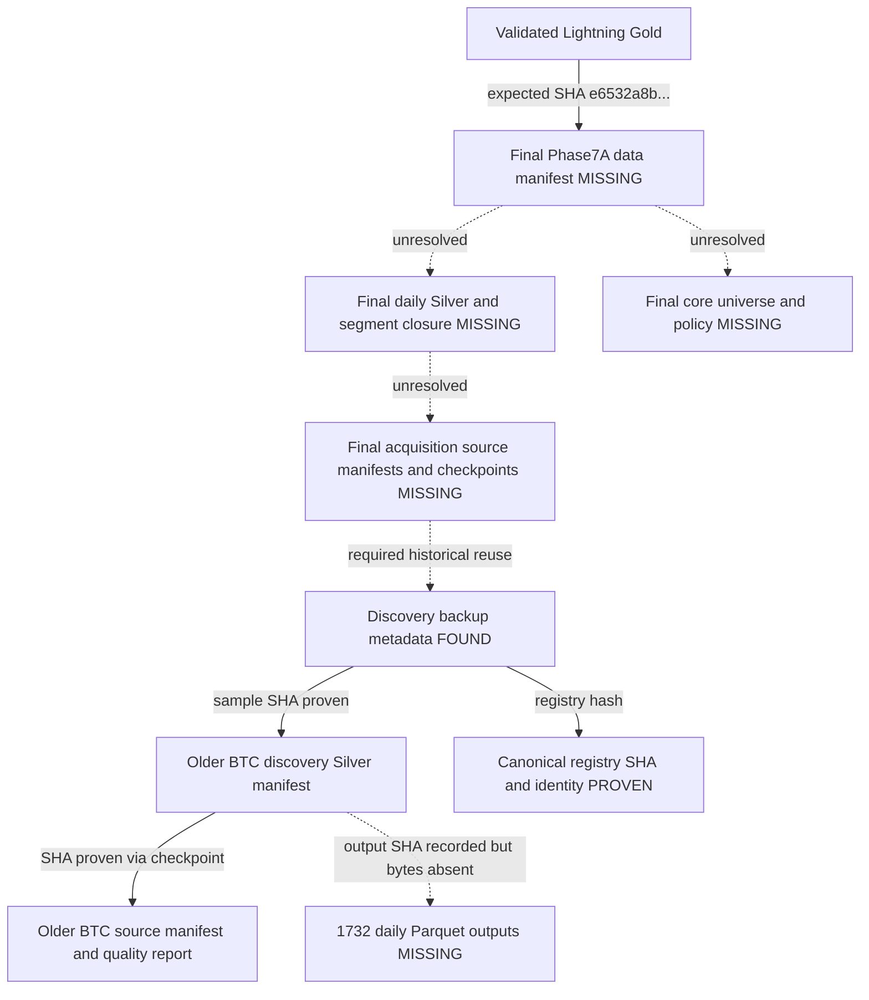

# Historical external-state recovery discovery — 2026-10-03

**TRUSTED_FINAL_SILVER_NOT_FOUND. FULL_LINEAGE_CLOSURE=NO.**
Read-only discovery only: no restore, recomputation, preparation, model, GPU or holdout
modelling. Gold was not opened, recopied or modified. Its previous byte/schema validation
remains PASS. Scientific methodology/configuration unchanged.

## Repository and evidence scope

Branch `phase7a-pre-lightning-hardening-20261003`; starting local and origin HEAD
`6d2de502f2d51884136edad25a075eddd7403d59`; tracked tree clean. Existing untracked
Linux evidence preserved. This document is the only repository change.
Code trace: `pipeline._load_stage_state`, `_fold_descriptors`; Phase7A runner
`_registry_stage`, `_reuse_discovery`, `_run_stage_owned`; `DiscoverySymbolCheckpointStore`;
`SilverPromoter`; `acquisition.load_candle_family`, `validated_candle_manifest_range`,
`_silver_segment_manifests`; `CheckpointStore`; training causal descriptor/cache identities.
Historical anchors: hold state, handoff manifest, current-state and checkpoint/resume docs;
previous Gold migration and external qualification reports.

All GCS commands used `CLOUDSDK_CONFIG=~/gcloud-user-config`. Completed flat metadata
inventories: `gcloud storage ls --json 'gs://crypto-ai-data-83921/**'` and corresponding
migration-bucket wildcard. These cover all live objects visible in those two buckets;
not deleted generations or inaccessible buckets. Project-wide bucket enumeration returned
403 storage.buckets.list denied. No IAM changes or authentication changes attempted.
The earlier directory-recursive inventory was interrupted and is not used for totals.
Full metadata evidence remains in `/tmp/crypto2-recovery-gcs-flat.json` and
`/tmp/crypto2-recovery-migration-inventory.json`; no raw datasets were downloaded.

## REQUIRED_STATE

A=artifact root; D=data root; C=checkpoint root;
R=`phase7a-core20-primary-93f987736b1a79d26b773957`;
S=`phase7-cc550337f1f4ee4654124bf6`. Historical repo root `/home/nssharath123/crypto2.0`.
Fold1 TRAIN end is 2022-01-01 exclusive. Descriptor window [2021-10-03,2022-01-01).
The current canonical `_fold_descriptors` derives descriptors for all 16 planned folds,
not only Fold1; all historical daily inputs through the relevant train ends are needed.
All scientific market history must remain before research cutoff 2026-07-01.

| Logical artifact | Exact filename/pattern from code | Version / expected identity | Time range | Producer → consumer | Preparation / lineage | Historical path |
| --- | --- | --- | --- | --- | --- | --- |
| Registry including lifecycle | registry/symbol_registry.json | symbol_registry_v1; b2c973f0050f205e58672558 | historical listing/availability through cutoff | registry builder → read_registry, universe, descriptors | Preparation YES | A/R and canonical A/S |
| Separate lifecycle file | None required: SymbolRecord available_from/available_until/onboard_date | Same registry identity | Historical lifecycle | registry → causal overlap | Embedded, not separately reconstructed | Same file |
| Core universe | universe/core_universe.json | core_universe_v1; f71cdf65d161466037b34420 | selection cutoff 2022-01-01 | _core_universe_stage → read_universe | Preparation YES | A/R |
| Universe policy | universe/expansion_policy.json | expected policy hash 8b07069e46bf6257961ea79d; research universe 94a9ce4759dd8d3303841f13 | fold train-end causal membership | universe producer → _load_stage_state | Preparation YES even CORE | A/R |
| PIT history/selection | universe/selection_descriptors.json, fold_memberships.json, discovery_data.json | descriptor/source maximum time and membership hashes | as_of/train-end causal | universe producer → history/reuse audit | Preparation support / lineage | A/R |
| Daily Silver | exact output_files[].file of referenced 1d Silver manifest | silver-{24hex}; sort-and-exact-deduplicate-v2-versioned-paths | daily lookbacks before each train end | SilverPromoter → _fold_descriptors/load_candle_family | Preparation YES, not lineage-only | D/phase7/silver/binance/versions/... |
| Silver manifest | manifests/silver-{identity}.json; or causal segment group referenced by data manifest | expected SHA from data/checkpoint/segment | accepted half-open causal coverage | promoter/segment builder → loader | Preparation YES | D/phase7/silver/binance |
| Discovery checkpoint | discovery/phase7_discovery_acquisition_v1/1.8.0/{SYMBOL}/{INTERVAL}.completed.json | phase7_discovery_symbol_checkpoint_v1; config S, registry/request/evidence hashes | discovery lookback to cutoff | DiscoverySymbolCheckpointStore → _reuse_discovery | Reuse/lineage YES | C/S |
| Full-range acquisition checkpoint | discovery/phase7_full_range_acquisition_v1/1.8.0/{SYMBOL}/{INTERVAL}.completed.json | full request coverage true; config R | lifecycle-clipped [2020-01-01,2026-07-01) | same store with strict coverage → acquisition reuse | Stage trust YES | C/R |
| Quality reports | quality/{report_id}.json | report_schema1.0.0; validator1.2.0; policy hash | source request range | QualityEngine → Silver trust | Required evidence | D/phase7 |
| Final data manifest | data/data_manifest.json | SHA e6532a8b6fe7246621530738b713c6529b538d219802ba77f3f3a4dad6959dd0 | acquisition to July1 exclusive | _data_stage → _load_stage_state | Preparation YES | A/R |
| Source lineage | source_manifest string in Silver; acquisition source manifests under manifests | source dataset/version/range; SHA where recorded | accepted lifecycle range | downloader → validated_candle_manifest_range | Preparation metadata YES | D/phase7/bronze/binance |
| Segments | segments[].silver_manifest; source_manifest; generated group manifest run_id.json | phase7_causal_segment_group; child SHA | causal non-overlapping segments | segment builder → _silver_segment_manifests | YES if segmented input | exact names await final data manifest |
| Context descriptors | fold_descriptors.json; numerical causal_descriptor_identity | source_max_time < train_end; memberships and numerical fields | 90d before train_end | build_point_in_time_descriptors → training/context rebinding | Preparation YES; cannot substitute later data | A/R plus daily source data |
| Phase7A stage/run | run.json; registry.json, universe.json, data.json, gold.json checkpoints | R/config93f987736b1a79d26b773957; checkpoint/file hashes | completed historical stages | runner → stage prerequisites | Preparation/reuse YES | A/R; C/R |
| Data checkpoint | data.json | SHA d7bb7e99dda07ec62cd493a3c06951d6dae230f340c065b9bd42bd2423a99c0f | completed acquisition | CheckpointStore → train guard | YES | C/R |
| Gold result/manifest | gold/result.json; dataset manifest.json | gold-phase7-0cbf2910e8d96c9d19826598; manifest a1420277... | before July1 | Gold stage → train resolver | YES; dataset already validated, result absent | A/R and existing Lightning Gold |
| Fold1 start/completion | canary_started.json; per-spec train/CORE/{fold_id}/{spec_id}.json | STARTED_NOT_COMPLETE; 0/48; no completed models | fold-000-a0e9a4f72689 | runner/training → resume | Start metadata relevant; do not invent completion | A/R; C/R |

## Complete candidate inventories

Historical bucket: 22,256 live objects, 7,397,532,419 bytes.
Migration bucket: 139 objects, 9,672,319,402 bytes; Gold only, 138 Parquet + manifest.
Oldest/newest below are provider creation/update timestamps, not market-data coverage.
All prefixes are under gs://crypto-ai-data-83921 unless explicitly noted.

| Prefix | Objects | Bytes | Oldest → newest UTC | Extensions | Confidence / role |
| --- | ---: | ---: | --- | --- | --- |
| artifacts/experiments/ | 27 | 544,074 | 2026-08-22T02:36:06.895000+00:00 → 2026-08-22T02:45:41.043000+00:00 | {'.csv': 1, '.json': 14, '.joblib': 6, '.parquet': 6} | UNRELATED earlier phases/source layers |
| artifacts/phase4/ | 56 | 2,579,573 | 2026-08-22T02:36:06.960000+00:00 → 2026-08-22T02:45:39.290000+00:00 | {'.json': 18, '.parquet': 24, '.joblib': 14} | UNRELATED earlier phases/source layers |
| artifacts/phase4_1/ | 78 | 247,274,005 | 2026-08-22T02:36:07.111000+00:00 → 2026-08-22T02:48:06.880000+00:00 | {'.json': 27, '.parquet': 33, '.joblib': 18} | UNRELATED earlier phases/source layers |
| artifacts/phase5/ | 803 | 296,652,515 | 2026-08-22T02:36:13.321000+00:00 → 2026-08-22T02:47:52.604000+00:00 | {'.json': 333, '.joblib': 66, '.parquet': 404} | UNRELATED earlier phases/source layers |
| artifacts/phase5_hardening/ | 1136 | 340,921,485 | 2026-08-22T02:40:12.296000+00:00 → 2026-08-22T02:48:04.385000+00:00 | {'.json': 270, '.parquet': 866} | UNRELATED earlier phases/source layers |
| artifacts/phase6/ | 31 | 31,900,078 | 2026-08-22T02:45:29.303000+00:00 → 2026-08-22T02:47:46.326000+00:00 | {'.json': 29, '.parquet': 2} | UNRELATED earlier phases/source layers |
| artifacts/phase7/backup-phase7-cc550337f1f4ee4654124bf6-20260904T044426Z/ | 3361 | 4,521,436,877 | 2026-09-04T04:45:17.642000+00:00 → 2026-09-04T04:46:44.638000+00:00 | {'.json': 3353, '.toml': 2, '.gz': 1, '.log': 1, '.txt': 3, '(none)': 1} | HIGH_CONFIDENCE historical metadata; final closure incomplete |
| artifacts/phase7/overnight/ | 1 | 3,666 | 2026-09-05T20:12:40.273000+00:00 → 2026-09-05T20:12:40.273000+00:00 | {'.json': 1} | HIGH_CONFIDENCE historical metadata; final closure incomplete |
| artifacts/phase7/phase7a-core20-primary-93f987736b1a79d26b773957/ | 4 | 5,190 | 2026-09-04T19:06:03.048000+00:00 → 2026-09-05T02:28:13.946000+00:00 | {'.sh': 1, '.json': 3} | HIGH_CONFIDENCE historical metadata; final closure incomplete |
| artifacts/phase7/project-hold-20260906/ | 6 | 1,032,376 | 2026-09-06T18:02:30.757000+00:00 → 2026-09-06T18:44:35.980000+00:00 | {'.bundle': 1, '.sha256': 2, '.gz': 2, '.json': 1} | HIGH_CONFIDENCE historical metadata; final closure incomplete |
| data/bronze/ | 8769 | 250,320,118 | 2026-08-22T01:41:53.055000+00:00 → 2026-08-22T01:44:38.432000+00:00 | {'.zip': 406, '.CHECKSUM': 406, '.json': 29, '.parquet': 7928} | UNRELATED earlier phases/source layers |
| data/gold/ | 18 | 1,418,363,844 | 2026-08-22T01:49:04.582000+00:00 → 2026-08-22T01:58:06.936000+00:00 | {'.parquet': 6, '.json': 12} | UNRELATED earlier phases/source layers |
| data/market/ | 10 | 689,107 | 2026-08-22T02:21:09.273000+00:00 → 2026-08-22T02:21:10.252000+00:00 | {'.parquet': 4, '.json': 6} | UNRELATED earlier phases/source layers |
| data/market/silver/funding/ | 4 | 202,916 | 2026-08-22T02:21:09.733000+00:00 → 2026-08-22T02:21:10.089000+00:00 | {'.parquet': 2, '.json': 2} | POSSIBLE Silver candidate; version must match |
| data/market/silver/index_kline/ | 2 | 34,053,838 | 2026-08-22T02:21:09.448000+00:00 → 2026-08-22T02:21:56.252000+00:00 | {'.parquet': 1, '.json': 1} | POSSIBLE Silver candidate; version must match |
| data/market/silver/mark_kline/ | 2 | 32,914,757 | 2026-08-22T02:21:09.435000+00:00 → 2026-08-22T02:21:54.982000+00:00 | {'.parquet': 1, '.json': 1} | POSSIBLE Silver candidate; version must match |
| data/quality/ | 15 | 55,819,246 | 2026-08-22T02:33:21.996000+00:00 → 2026-08-22T02:34:23.127000+00:00 | {'.json': 15} | UNRELATED earlier phases/source layers |
| data/quarantine/ | 3 | 2,886,015 | 2026-08-22T02:34:53.381000+00:00 → 2026-08-22T02:34:57.504000+00:00 | {'.json': 3} | UNRELATED earlier phases/source layers |
| data/silver/binance/klines/ | 7921 | 154,064,609 | 2026-08-22T01:45:38.439000+00:00 → 2026-08-22T01:46:27.807000+00:00 | {'.parquet': 7921} | POSSIBLE Silver candidate; version must match |
| data/silver/binance/manifests/ | 9 | 5,868,130 | 2026-08-22T01:46:27.411000+00:00 → 2026-08-22T01:46:29.073000+00:00 | {'.json': 9} | POSSIBLE Silver candidate; version must match |

Manifest/checkpoint filenames in Phase7 candidates: backup_manifest.json;
registry/{catalog_summary,source_verification,symbol_registry}.json; registry.json;
713 *.completed.json across versioned/unversioned discovery directories;
532 Silver metadata files and 687 quality files in the backup inventory.
No Parquet in the canonical backup. Pretraining prefix: pretraining_manifest.json,
runtime-authority.json, runtime-authority-resume.json, phase7a_guest_stop.sh.
Overnight: overnight_fold1_status.json. Hold: project-hold-20260906-manifest.json,
Git bundle and reports tar.gz with checksum sidecars. Expired authorities/scripts were not run.
No core_universe.json, expansion_policy.json, final data_manifest.json,
fold_memberships.json, canary_started.json or full-range acquisition prefix found in
complete historical inventory. Provider object names containing segment are metadata
candidates, not proof of final causal segment binding.

## Silver assessment

1. Canonical discovery Silver metadata: BTC silver-f358c81461a340259346fc68,
   [2021-10-03,2026-07-01), 1d, 1,732 output records. Manifest SHA matches
   discovery checkpoint. Source/quality SHA also match. Parquet outputs are not in
   the canonical backup or elsewhere at their matching logical suffixes in this bucket.
   This proves an older discovery chain, not final Phase7A daily acquisition selection.
2. data/silver/binance/: 7,921 Parquet, 154,064,609 bytes; nine manifests,
   5,868,130 bytes. Downloaded all nine manifests only. They reference Windows
   C:\Users\HP\Documents\ChatGPT\crypto2.0 and transformation
   sort-and-exact-deduplicate-v1 / validator1.0.0, not canonical v2/validator1.2.0.
   BTC 5m/12h/1d/1m histories and small subsets; reject as final Phase7A replacement.
3. data/market/silver/{funding,index_kline,mark_kline}: derivative Silver;
   not required daily candle Silver; no final Phase7A identity binding established.
4. Migrated bucket: Gold only, no Silver.

TRUSTED_FINAL_SILVER_NOT_FOUND. Exact final Silver version, partition count, bytes,
symbol closure and coverage cannot be established without final data_manifest.json.
No candidate selected and no scientific equivalence inferred from filename/size.

## Registry, universe and checkpoint findings

Downloaded canonical registry validates as symbol_registry_v1 with 790 records;
registry_hash b2c973f0050f205e58672558 matches Gold. SHA matches backup and registry
checkpoint. HNT availability [2020-09-01,2024-06-01); last recorded market candle
2024-05-31T23:55Z. XPIN remains an historical registry record, availability
[2025-09-01,2026-07-01), onboard 2025-09-12T08:00Z; it is not thereby Core20-eligible.
The pretraining and hold records retain HNT in Core20 and exclude XPIN, core hash
f71cdf65d161466037b34420. Core artifact and expansion policy themselves were not found.
Do not interpret 790 registry records as 790 discovery candidates: discovery is 507.

Registry checkpoint internal stable_hash PASS, all three file references independently
SHA-proven from downloaded metadata. Its historical phase7_version1.3.0 is preserved;
not upgraded to current1.8.0. Sample versioned BTC discovery checkpoint internal hash
PASS, request/config/registry/quality/Silver lineage consistent. 713 backup filenames
include duplicates/version directories; not claimed as 713 candidates or full 507 audit.
No final strict acquisition checkpoint/data checkpoint bytes found.

Pretraining manifest config/core identities agree but data/gold/train were NOT_STARTED.
Overnight report anchors the correct final data checkpoint/manifest hashes but predates
final successful Gold and says Fold1 not started. Hold manifest records later final
STARTED_NOT_COMPLETE, 0/48 reports, zero models, 0/16 folds; no Fold1 completion file found.
These dated reports cannot substitute for missing checkpoint inventories.

## Downloaded metadata: transport and project hashes

20 metadata objects downloaded to /tmp only. Every provider MD5 comparison PASS.
CRC32C and immutable generation recorded below as provider evidence; CRC32C not
independently recomputed. Backup SHA anchors matched where available. Reports outside
backup have SHA recorded plus provider MD5, not invented independent project anchors.
The previous /tmp/crypto2-backup-manifest.json was reused, not downloaded again.

| Object (historical bucket-relative) | Bytes | Local SHA-256 | Provider MD5 | CRC32C | Generation | Identity evidence |
| --- | ---: | --- | --- | --- | --- | --- |
| artifacts/phase7/backup-phase7-cc550337f1f4ee4654124bf6-20260904T044426Z/local_artifacts/phase7/phase7-cc550337f1f4ee4654124bf6/registry/catalog_summary.json | 154 | d2765956f8e1948120ae4842f0d021c3f1f170b9ab39d6c45776c55703a4eb84 | U5uHaNfdX8MzOAEgi1sxHg== | 9WW8zw== | 1788497123963397 | PASS |
| artifacts/phase7/backup-phase7-cc550337f1f4ee4654124bf6-20260904T044426Z/local_artifacts/phase7/checkpoints/phase7-cc550337f1f4ee4654124bf6/discovery/phase7_discovery_acquisition_v1/1.8.0/BTCUSDT/1d.completed.json | 3549 | 194633fbf8b41c3b663fae417a55457313c2ffd47b59092a8e8ffc33d367b3d6 | Bj/Ftc8qq7SSiWnNiCk1rg== | bCNP1g== | 1788497121135726 | PASS |
| artifacts/phase7/project-hold-20260906/project-hold-20260906-manifest.json | 5384 | 096c6c47440dda32b238d8b403a61b1c5783bdc306213af1b81a570322e7956f | 6l+/jtcN2IQuHRSI/wvQzw== | OXBO1A== | 1788717750833741 | Transport PASS; SHA recorded, no independent project anchor |
| data/silver/binance/manifests/silver-0a83673d07809128a86f2668.json | 1766139 | 6eaf83edb6a59e88212a99f7c48276a36eb5601c8338d65433e49869c9b7df7b | RHKtk6zct2NEXockP7QqhA== | Lg5uLg== | 1787363188979799 | Transport PASS; SHA recorded, no independent project anchor |
| data/silver/binance/manifests/silver-5a1b9c3c56d74dd754ed0b0a.json | 1786707 | cd20a8e39ec200e82f425932e7eac2a6013cf17925b1731bac188f834ddd09f9 | EVgOGEhJEyhkgyWXmirMvg== | YFPOdw== | 1787363188807815 | Transport PASS; SHA recorded, no independent project anchor |
| data/silver/binance/manifests/silver-65567912c320675c08703eae.json | 78370 | 816bd9aac7b76e1ece25c5a2488b1774137fc242a86617871ac3bfa35be34345 | TAaw4yuotuGIypFJtBkJQQ== | /PXDEg== | 1787363187424769 | Transport PASS; SHA recorded, no independent project anchor |
| data/silver/binance/manifests/silver-7105362e4dc25f97784d8f9a.json | 21954 | d64e11c2e69e62d4d546e712c45efab5ccaba563387a0b9bce0526bd727e75ee | MBg9sAznmW1GFMEbRCt5cw== | TY78Ng== | 1787363187407589 | Transport PASS; SHA recorded, no independent project anchor |
| data/silver/binance/manifests/silver-79eebd2f1b7a38a13f1f0bb5.json | 79516 | 65eff2311d6bec57fea2fbe876449715799c9bfd508ba35b87089ce617d3bdad | He0M3ma+ja2ARsYAF77b9A== | LuPWvg== | 1787363187451583 | Transport PASS; SHA recorded, no independent project anchor |
| data/silver/binance/manifests/silver-7f6d09b0d30767698f12f843.json | 295250 | a2b87d2c6f9c561970416b14ddb0751a723f5274cece8af62a0d2009676ee061 | xw+LIX6j/dvToqFM04InuQ== | uC6+Bw== | 1787363187728074 | Transport PASS; SHA recorded, no independent project anchor |
| data/silver/binance/manifests/silver-a935bf75925c5be98e5b8e98.json | 79862 | 75da3753751fed0e9a094d659bf396229e50976c9a0fb5a9d0af7d555d872b15 | Pz6Ccf+/cmsaA+/b5Vcmpw== | yPn8Xg== | 1787363187560176 | Transport PASS; SHA recorded, no independent project anchor |
| data/silver/binance/manifests/silver-c0d92b55351e4881836bafa3.json | 1313 | a38d503811ebcad6bbf7409bcb42952e94b4d24a566b9adc67d019f17162c116 | vhp1Hgf2AY86y7YUkjHR9A== | 7QgPhA== | 1787363187566770 | Transport PASS; SHA recorded, no independent project anchor |
| data/silver/binance/manifests/silver-eb25a8aeaf7de2e33c72b984.json | 1759019 | 033ef6b7390166d2031196dd42ad2923d973e43665e3a00bacb125c8c4751a4d | DZ2SBfCI0rF59Xioyw6JPA== | Q9cUaw== | 1787363189069161 | Transport PASS; SHA recorded, no independent project anchor |
| artifacts/phase7/overnight/phase7a-core20-primary-93f987736b1a79d26b773957/overnight_fold1_status.json | 3666 | 92db1f388c6b8489326d0c5f4b79353d26b6ef4273f5520baad08662d8d974ba | GoW3dqRkVj5VTNVJOzDyvA== | d5tVaA== | 1788639160261870 | Transport PASS; SHA recorded, no independent project anchor |
| artifacts/phase7/phase7a-core20-primary-93f987736b1a79d26b773957/pretraining/pretraining_manifest.json | 2506 | 8af91c98eb6fce4951765277b579f7f7868d0682b34cbd305d202c25cd3a29e4 | OZ7V73PPVzJqlA+Tf8FXvg== | qtTHnA== | 1788548763039741 | Transport PASS; SHA recorded, no independent project anchor |
| artifacts/phase7/backup-phase7-cc550337f1f4ee4654124bf6-20260904T044426Z/data/phase7/quality/quality-57bf84b71730c970d163ab83.json | 8258220 | 139eb12f4595a97452c10896142ae8e2970380493022ce24d2c6e22359347e57 | KxbQkjjzRam2mCnjvSKMyw== | V1OSog== | 1788497146807384 | PASS |
| artifacts/phase7/backup-phase7-cc550337f1f4ee4654124bf6-20260904T044426Z/local_artifacts/phase7/checkpoints/phase7-cc550337f1f4ee4654124bf6/registry.json | 1004 | 5c241ded1e2658c2723548eedcca9143c0342ce1a85797387ad3176c2bd712aa | ispejEMfa5pvpVLGyfdDfA== | mJwC6g== | 1788497117656738 | PASS |
| artifacts/phase7/backup-phase7-cc550337f1f4ee4654124bf6-20260904T044426Z/local_artifacts/phase7/phase7-cc550337f1f4ee4654124bf6/registry/symbol_registry.json | 2193617 | 200d9d63be9d8cae9799cb81f2bb886620a8ddb033c3ab7d4687fc2c310bcbd4 | vpt3EKJfzEwiydmpe6mggQ== | Na4qFQ== | 1788497124098561 | PASS |
| artifacts/phase7/backup-phase7-cc550337f1f4ee4654124bf6-20260904T044426Z/data/phase7/silver/binance/manifests/silver-f358c81461a340259346fc68.json | 1346376 | 278d569d738e9a4e2e39b36709d02b83831e3d71912760464decaa6ba97b71ef | zQxhpjcZa/8ivFbMOtFW1g== | 8USKbA== | 1788497187086034 | PASS |
| artifacts/phase7/backup-phase7-cc550337f1f4ee4654124bf6-20260904T044426Z/data/phase7/bronze/binance/manifests/usdm-btcusdt-1d-6cb5ab5e53fcb1ed.json | 2941840 | 492b722533fa2c32ff7c100062a1f73ef3093924cf02231cc1910f0e5711848e | 8L2TLdINhSlM/z+NXAMvFA== | q9+0KQ== | 1788497169931291 | PASS |
| artifacts/phase7/backup-phase7-cc550337f1f4ee4654124bf6-20260904T044426Z/local_artifacts/phase7/phase7-cc550337f1f4ee4654124bf6/registry/source_verification.json | 971 | 984ca1ac3bb7b2ca76b81a2a74e11b53c3bb73a92560c1dbba7acb6d81c91bb0 | 67mZOsm42rPwWYydr/+fpw== | 6GMbRA== | 1788497123960555 | PASS |

## Manifest lineage graph

Gold→finalSilver UNRESOLVED; final Silver→source→segments→acquisition UNRESOLVED.
Discovery→registry and sampled older discovery→Silver/source/quality metadata resolved,
but this does not close final acquisition lineage. FULL_LINEAGE_CLOSURE=NO.

## Legacy-path preview

Unique absolute path strings in the 20 downloaded JSON objects are enumerated below.
Counts include historical traceback/report string references; not all are executable inputs.
Only direct GCP repo-relative references can be mapped to canonical backup paths here.
Windows datasets and final Phase7A paths remain unresolved. No mappings activated.
Proposed root P=/teamspace/studios/this_studio/crypto2-persistent;
local_artifacts/phase7 suffix maps to P/phase7/artifacts (checkpoint subtree separately
P/phase7/checkpoints); data suffix maps to P/data. Hash-proven means candidate metadata
bytes verified, not restored or independently approved final-run compatibility.

| OLD_PATH | Logical role / proposed Lightning path | Candidate GCS source (bucket-relative) | Expected SHA | Candidate SHA | Match? |
| --- | --- | --- | --- | --- | --- |
Found 9,727 unique absolute path strings; 6 candidate metadata references are hash-proven. Most remaining strings are individual historical source/output partition references, unavailable in the searched archive. No remap performed.

| /home/nssharath123/crypto2.0/data/phase7/bronze/binance/manifests/usdm-btcusdt-1d-6cb5ab5e53fcb1ed.json | P/data/phase7/bronze/binance/manifests/usdm-btcusdt-1d-6cb5ab5e53fcb1ed.json | artifacts/phase7/backup-phase7-cc550337f1f4ee4654124bf6-20260904T044426Z/data/phase7/bronze/binance/manifests/usdm-btcusdt-1d-6cb5ab5e53fcb1ed.json | 492b722533fa2c32ff7c100062a1f73ef3093924cf02231cc1910f0e5711848e | 492b722533fa2c32ff7c100062a1f73ef3093924cf02231cc1910f0e5711848e | YES |
| /home/nssharath123/crypto2.0/data/phase7/quality/quality-57bf84b71730c970d163ab83.json | P/data/phase7/quality/quality-57bf84b71730c970d163ab83.json | artifacts/phase7/backup-phase7-cc550337f1f4ee4654124bf6-20260904T044426Z/data/phase7/quality/quality-57bf84b71730c970d163ab83.json | 139eb12f4595a97452c10896142ae8e2970380493022ce24d2c6e22359347e57 | 139eb12f4595a97452c10896142ae8e2970380493022ce24d2c6e22359347e57 | YES |
| /home/nssharath123/crypto2.0/data/phase7/silver/binance/manifests/silver-f358c81461a340259346fc68.json | P/data/phase7/silver/binance/manifests/silver-f358c81461a340259346fc68.json | artifacts/phase7/backup-phase7-cc550337f1f4ee4654124bf6-20260904T044426Z/data/phase7/silver/binance/manifests/silver-f358c81461a340259346fc68.json | 278d569d738e9a4e2e39b36709d02b83831e3d71912760464decaa6ba97b71ef | 278d569d738e9a4e2e39b36709d02b83831e3d71912760464decaa6ba97b71ef | YES |
| /home/nssharath123/crypto2.0/local_artifacts/phase7/checkpoints/phase7a-core20-primary-93f987736b1a79d26b773957/gold.json | P/phase7/checkpoints/phase7a-core20-primary-93f987736b1a79d26b773957/gold.json | UNRESOLVED | UNKNOWN | NOT DOWNLOADED | NO |
| /home/nssharath123/crypto2.0/local_artifacts/phase7/phase7-cc550337f1f4ee4654124bf6/registry/catalog_summary.json | P/phase7/artifacts/phase7-cc550337f1f4ee4654124bf6/registry/catalog_summary.json | artifacts/phase7/backup-phase7-cc550337f1f4ee4654124bf6-20260904T044426Z/local_artifacts/phase7/phase7-cc550337f1f4ee4654124bf6/registry/catalog_summary.json | d2765956f8e1948120ae4842f0d021c3f1f170b9ab39d6c45776c55703a4eb84 | d2765956f8e1948120ae4842f0d021c3f1f170b9ab39d6c45776c55703a4eb84 | YES |
| /home/nssharath123/crypto2.0/local_artifacts/phase7/phase7-cc550337f1f4ee4654124bf6/registry/source_verification.json | P/phase7/artifacts/phase7-cc550337f1f4ee4654124bf6/registry/source_verification.json | artifacts/phase7/backup-phase7-cc550337f1f4ee4654124bf6-20260904T044426Z/local_artifacts/phase7/phase7-cc550337f1f4ee4654124bf6/registry/source_verification.json | 984ca1ac3bb7b2ca76b81a2a74e11b53c3bb73a92560c1dbba7acb6d81c91bb0 | 984ca1ac3bb7b2ca76b81a2a74e11b53c3bb73a92560c1dbba7acb6d81c91bb0 | YES |
| /home/nssharath123/crypto2.0/local_artifacts/phase7/phase7-cc550337f1f4ee4654124bf6/registry/symbol_registry.json | P/phase7/artifacts/phase7-cc550337f1f4ee4654124bf6/registry/symbol_registry.json | artifacts/phase7/backup-phase7-cc550337f1f4ee4654124bf6-20260904T044426Z/local_artifacts/phase7/phase7-cc550337f1f4ee4654124bf6/registry/symbol_registry.json | 200d9d63be9d8cae9799cb81f2bb886620a8ddb033c3ab7d4687fc2c310bcbd4 | 200d9d63be9d8cae9799cb81f2bb886620a8ddb033c3ab7d4687fc2c310bcbd4 | YES |
| C:\Users\HP\Documents\ChatGPT\crypto2.0\data\bronze\binance\manifests\reconciled-usdm-btcusdt-5m-54406c13c5b4ec012006417d.json | Legacy Windows metadata; no accepted mapping | UNRESOLVED | UNKNOWN | NOT DOWNLOADED | NO |
| C:\Users\HP\Documents\ChatGPT\crypto2.0\data\bronze\binance\manifests\usdm-btcusdt-12h-1631017decb28b30.json | Legacy Windows metadata; no accepted mapping | UNRESOLVED | UNKNOWN | NOT DOWNLOADED | NO |
| C:\Users\HP\Documents\ChatGPT\crypto2.0\data\bronze\binance\manifests\usdm-btcusdt-12h-4e0ecff898b65708.json | Legacy Windows metadata; no accepted mapping | UNRESOLVED | UNKNOWN | NOT DOWNLOADED | NO |
| C:\Users\HP\Documents\ChatGPT\crypto2.0\data\bronze\binance\manifests\usdm-btcusdt-1d-2fc085480d78a0ce.json | Legacy Windows metadata; no accepted mapping | UNRESOLVED | UNKNOWN | NOT DOWNLOADED | NO |
| C:\Users\HP\Documents\ChatGPT\crypto2.0\data\bronze\binance\manifests\usdm-btcusdt-1d-c67def319a462d7d.json | Legacy Windows metadata; no accepted mapping | UNRESOLVED | UNKNOWN | NOT DOWNLOADED | NO |
| C:\Users\HP\Documents\ChatGPT\crypto2.0\data\bronze\binance\manifests\usdm-btcusdt-1m-b3b4dc6151d14428.json | Legacy Windows metadata; no accepted mapping | UNRESOLVED | UNKNOWN | NOT DOWNLOADED | NO |
| C:\Users\HP\Documents\ChatGPT\crypto2.0\data\bronze\binance\manifests\usdm-btcusdt-5m-32e89aae75adbdc5.json | Legacy Windows metadata; no accepted mapping | UNRESOLVED | UNKNOWN | NOT DOWNLOADED | NO |
| C:\Users\HP\Documents\ChatGPT\crypto2.0\data\bronze\binance\manifests\usdm-btcusdt-5m-48a971eb509ecb74.json | Legacy Windows metadata; no accepted mapping | UNRESOLVED | UNKNOWN | NOT DOWNLOADED | NO |
| C:\Users\HP\Documents\ChatGPT\crypto2.0\data\bronze\binance\manifests\usdm-btcusdt-5m-9cdc7ed8220c467c.json | Legacy Windows metadata; no accepted mapping | UNRESOLVED | UNKNOWN | NOT DOWNLOADED | NO |

## Persistent runtime-root plan (design only)

| Role | Path / eventual environment override |
| --- | --- |
| Data/Silver | P/data — PHASE7_DATA_ROOT |
| Gold | P/data/gold/phase7a_core20_primary_v1 — PHASE7_GOLD_ROOT; dataset remains unchanged |
| Checkpoints | P/phase7/checkpoints — PHASE7_CHECKPOINT_ROOT |
| Prepared cache | P/phase7/prepared_cache — PHASE7_CACHE_ROOT |
| Models | P/phase7/models — PHASE7_MODEL_ROOT |
| Reports | P/phase7/reports — PHASE7_REPORT_ROOT |
| Artifacts | P/phase7/artifacts — PHASE7_ARTIFACT_ROOT |
| Logs | P/phase7/logs — PHASE7_LOG_ROOT |
| Temp | P/phase7/tmp — PHASE7_TEMP_ROOT |
| Benchmark | P/phase7/benchmark-isolated — future isolated BENCHMARK_ONLY output |

Eventually bind PHASE7_LEGACY_DATA_ROOT=/home/nssharath123/crypto2.0/data and
PHASE7_LEGACY_ARTIFACT_ROOT=/home/nssharath123/crypto2.0/local_artifacts/phase7
only after each referenced object is verified. Configure separate legacy GOLD/MODEL/REPORT
roots from actual evidence. Prefix differences alone never authorize wrong bytes.
Set device/cache/validation-report variables only under the next reviewed scope; keep cloud
research guard unset. Canonical TOML unchanged. No directories populated or roots activated.
RUNTIME_ROOT_PLAN=PASS as design, not production writability/capacity/readiness qualification.

## Recommended restore set and blockers

A limited future metadata restore could use the SHA-proven canonical registry plus
catalog_summary/source_verification and registry checkpoint. Preserve original bytes and
run S; do not fabricate a Phase7A registry checkpoint. Existing backup manifests/discovery
metadata are candidates for historical reuse only after full request/config/hash audit.

An **exact full restore set is not yet identified**. Required final bundle must include
A/R registry/universe/policy/data/Gold result/run/start metadata, C/R completed stage and
strict candle checkpoints, and the final data manifest's complete daily Silver/output,
source, segment and quality closure. The final data manifest SHA must equal
 e6532a8b6fe7246621530738b713c6529b538d219802ba77f3f3a4dad6959dd0;
data checkpoint SHA must equal
 d7bb7e99dda07ec62cd493a3c06951d6dae230f340c065b9bd42bd2423a99c0f.
Other candle/derivative objects required by checkpoint inventories must also be preserved.
Do not invent a complete Fold1 checkpoint when historical state is 0/48.

1. Final Phase7A metadata/checkpoint closure absent from both searched buckets.
2. Trusted final daily Silver Parquet archive not found; canonical backup explicitly excludes it.
3. Other buckets cannot be enumerated with current project permission; preserved historical
   disk is documented but current contents were not inspected. No compute/disk actions authorized.

NEXT SAFE ACTION: owner identifies another immutable final-state backup or authorizes a
separate read-only recovery plan for the preserved GCP disk. Do not boot/attach/snapshot it
or restore large data in this phase. No IAM changes required or attempted.
SAFE_TO_RESTORE_EXTERNAL_STATE=NO for the full dependency set.
READY_FOR_PREPARATION_PROFILE=NO; TRAINING_READY=NO. July2026 unused;
August LOCKED_UNUSED, used=false, evaluation_authorized=false.
Documentation-only diff check required; no source change or training test execution needed.
