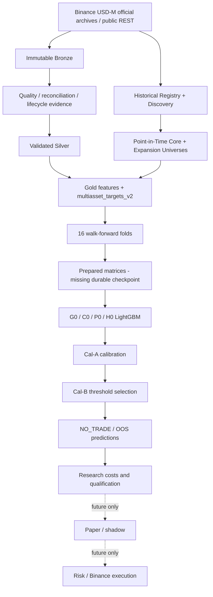

# System Architecture

## End-to-end view

Source: [diagrams/overall_architecture.mmd](diagrams/overall_architecture.mmd).

## Phase 7 module map

| Module | Responsibility and important entry points | Inputs → outputs | Checkpoint/failure behavior |
| --- | --- | --- | --- |
| `config.py` | Frozen Pydantic config, `load_phase7_config`, stable identity | TOML → validated config/hash | Rejects invariant violations before work |
| `sources.py` | `BinancePublicDiscoveryClient`, official source manifest | ExchangeInfo/archive catalog → source evidence | Public-only; errors remain explicit |
| `registry.py` | `build_symbol_registry`, read/write registry | Current + historical evidence → `SymbolRegistry` | Immutable identity; retains delisted symbols |
| `discovery_checkpoint.py` | Per-symbol discovery evidence store | Evidence files → validated symbol checkpoint | Checksums and required-file validation |
| `segments.py` | Causal gap/acquisition outcome models | Quality/reconciliation facts → usable segments | Missing active data fails closed |
| `acquisition.py` | Official archive download, REST reconciliation, Silver promotion, causal segments, derivative alignment | Registry/config → Bronze/Silver manifests and tables | Resume-safe; no synthesis; quality rejection is explicit |
| `quality.py` | `assess_symbol_quality`, point-in-time descriptors | Silver rows → causal coverage/liquidity/history descriptors | Invalid quality makes eligibility explicit |
| `universe.py` | Core selection, expansion policy, fold-local membership | Registry/descriptors/config → frozen universes/hashes | Future information forbidden; duplicates fatal |
| `features.py` | Native, anchor, market and HTF feature creation/rebinding | Causal Silver tables → feature table | Gap-reset rolling state; null rather than fill |
| `targets.py` | `generate_multiasset_targets` | Candles + causal scale → v2 target/path rows | Requires consecutive path; cutoff/lifecycle gaps invalidate |
| `gold.py` | Feature/target join, ablation schemas, partitioned chunks | Features + targets → Gold partitions/manifest | Atomic output; duplicate keys/finiteness contracts |
| `folds.py` | Calendar planning, causal membership, split slicing, clusters/tiers | Gold + universe → TRAIN/Validation/Cal/Test fold data | Actual-label purge and embargo; no eligible rows fail loudly |
| `models.py` | Matrix preparation and G0/C0/P0/H0 fitting | Fold tables → `Phase7ModelBundle` | Bounded workers; temp+replace model save; no overwrite |
| `metrics.py` | Regression, macro/per-symbol/cluster/age and cross-sectional metrics | OOS actual/prediction rows → metrics | Rejects empty/nonfinite covered evaluation |
| `economics.py` | Cal-B threshold choice, non-overlap trades, cost stress | Predictions + TRAIN-frozen tiers → trade/economic reports | Insufficient Cal-B trades selects NO_TRADE |
| `training.py` | Experiment matrix, calibration, frozen TEST release, per-spec reports | Gold/folds/specs → models, reports, fold summary | Completed artifacts resume; defects fail rather than become ineligible |
| `artifacts.py` | Atomic JSON/Parquet, `CheckpointStore`, partition scan, resource snapshot | Runtime objects → immutable files/checkpoints | Write-temp/replace; required files and identities validated |
| `progress.py` | Operational status and runtime projections | Checkpoints/reports → human/JSON progress | Does not alter science |
| `pipeline.py` | Stage orchestration: registry→universe→data→Gold→train→report | Valid config + cloud guard → run artifacts | Stage checkpoints; incomplete output is not COMPLETE |
| `runner.py` | Safe validate/plan/test/dry-run entry points | Config → no-network planning/fixtures | Heavy work remains cloud-guarded |
| `fixtures.py` | Deterministic synthetic fixtures | Test parameters → small tables/registries | Test-only; never real market history |

Operational wrappers under `scripts/` provide the Phase 7A runner, worker, guest supervisor,
feasibility gate, control-plane watchdog, and log rotation. They are controls around the pipeline,
not scientific owners. See [FILE_INDEX.md](FILE_INDEX.md).

## Stage ownership

Bronze is source truth; Silver is quality-approved source data; Gold is immutable model-ready
research data. Universe membership and folds are separate causal identities. TRAIN owns model
parameters, clusters, tiers and preprocessing; Validation owns early stopping and hybrid residual
support; Cal-A owns calibrator fitting; Cal-B owns threshold selection; TEST is released only after
all identities freeze. The dashboard/legacy live files are not part of this architecture.

## Current broken boundary

The durable sequence ends at Gold, then resumes at completed per-spec model/report artifacts. There
is no persisted prepared Fold-1 matrix boundary between them. This is an operational checkpointing
defect, not evidence of bad model quality. Details: [16_CHECKPOINT_AND_RESUME.md](16_CHECKPOINT_AND_RESUME.md).
